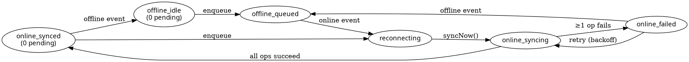

# Offline Sync State Machine

Sprint 25 Bucket QQ. Centralized orchestrator for offline operations.

## Why

Before this module, offline sync had three disjoint surfaces:

1. `saveForSync()` in `src/utils/pwa-offline.ts` (IndexedDB / SQLite per-platform).
2. `matrixSyncManager` in `src/services/syncManager.ts` (RiskNode-specific batched writes with embedding generation).
3. `OfflineSyncManager.tsx` (React component that drains the legacy queue on `online`).

Modals called `saveForSync()` ad-hoc. UI components had no central place to ask "what's the sync state right now?", so the offline indicator only knew `navigator.onLine` — never the actual queue depth or whether any op had failed.

## What

`OfflineSyncStateMachine` (`src/services/sync/syncStateMachine.ts`) provides:

- A single, IndexedDB-persisted queue (via `idb-keyval`, already in deps — no new dependency).
- A Zustand-light `subscribe(snap => ...)` API consumed via `useSyncState()`.
- Per-operation exponential backoff with give-up after 6 attempts.
- Last-write-wins deduplication keyed on `${collection}:${type}:${docId}`.

It does **not** replace `matrixSyncManager` — RiskNode sync keeps its embedding-aware batched path. `saveForSync()` now delegates to the state machine so the existing modal callers feed the central queue without code changes.

## State diagram



## API contract

```ts
interface SyncStateMachineApi {
  subscribe(cb: (snap: SyncStateSnapshot) => void): () => void;
  getState(): SyncStateSnapshot;
  enqueue(op: Omit<SyncOperation, 'id' | 'attempts' | 'createdAt'>): Promise<string>;
  syncNow(): Promise<{ succeeded: number; failed: number }>;
  clearQueue(): Promise<void>;
  setExecutor(fn: SyncExecutor): void;
}
```

`subscribe` fires the callback **synchronously** with the current snapshot during the call itself, so React components rendering after mount don't need a follow-up `getState()` call to avoid a stale-state flash.

`enqueue` returns the assigned op id. If the dedup key matches an existing op, the existing id is returned and the entry is replaced in place (last-write-wins).

`syncNow` is safe to call concurrently — overlapping calls short-circuit. Returns counts for the current pass only; queued ops still in their backoff window are skipped.

## Backoff schedule

Indexed by attempt count (after the Nth failure):

| Attempt | Wait      |
|---------|-----------|
| 1       | 1 s       |
| 2       | 5 s       |
| 3       | 30 s      |
| 4       | 5 min     |
| 5       | 30 min    |
| 6+      | give up — op is dropped from the queue with an error log |

Jitter is not applied (the queue is per-user, not a fan-in of clients hammering a shared backend).

## Deduplication rules

The dedup key is `${collection}:${type}:${docId}`, where `docId` is `data.id || data.docId || ''`.

- Two `update` ops on `iperRecords/abc` collapse — the second wins, attempts reset to 0.
- An `update` followed by a `delete` on the same id does **not** collapse — different `type` segment in the key. Both run in queue order, which is the right semantic (delete supersedes update at the network level anyway).
- Ops without any id (e.g. `create`) collapse on `${collection}:create:`. **Callers should pass a stable client-generated id in `data.id` for creates** if they want each create to be a distinct op.

## Common scenarios

### Modal submit while offline

1. User taps Save in a modal.
2. Modal calls `saveForSync({ type: 'create', collection: 'docs', data })`.
3. `saveForSync` writes to IndexedDB/SQLite (legacy queue) AND delegates to `offlineSync.enqueue()` (state machine).
4. State machine transitions to `offline_queued`, pending count increments by 1.
5. `OfflineIndicator` (subscribed via `useSyncState()`) re-renders showing "Pendiente: 1 cambio".

### Reconnect

1. `online` event fires.
2. State machine notifies subscribers (badge becomes spinner: "Sincronizando…").
3. `syncNow()` runs the executor over each op past its backoff window.
4. On success, op is dropped from queue and `lastSyncSuccessMs` is persisted.
5. On all-success, state returns to `online_synced` and the badge briefly shows "Sincronizado" before fading.

### Stuck op

If a single op has hit `MAX_ATTEMPTS` (6), it is dropped with an `error`-level log so the user is not blocked forever. An admin can also force-clear via `POST /api/admin/sync/clear-user-queue`. Server-side `GET /api/admin/sync/stats` aggregates stuck users for the operator dashboard.

### Mid-modal-submit network loss

If the network drops while the executor is mid-flight on op X:

- The executor `Promise` rejects (Firestore SDK throws on transport failure).
- The state machine increments `attempts` for op X, sets `lastError`, leaves it in the queue.
- The next `syncNow()` (triggered by the eventual `online` event or the scheduled retry timer) tries again after the backoff window.

No partial writes are silently lost — the op is reattempted until it succeeds or hits MAX_ATTEMPTS.

## Server endpoints

Both gated by admin role (mirrors the rest of `/api/admin/*`).

- `POST /api/admin/sync/clear-user-queue { targetUid }` — sets `clearRequested: true` on `user_sync_state/{targetUid}`. The client honors this on next subscription and drops its local queue.
- `GET /api/admin/sync/stats` — aggregates pending op counts and surfaces the worst-offending stuck users (top 25 by pending count). Backs the operator dashboard widget.

## Testing

`src/services/sync/syncStateMachine.test.ts` — 10 tests covering initial state, offline enqueue, drain on reconnect, failure with backoff, dedup, subscribe/unsubscribe, clearQueue, MAX_ATTEMPTS drop, backoff monotonicity, and `online_syncing` observability mid-executor.

Run with: `npx vitest run src/services/sync/syncStateMachine.test.ts`.
