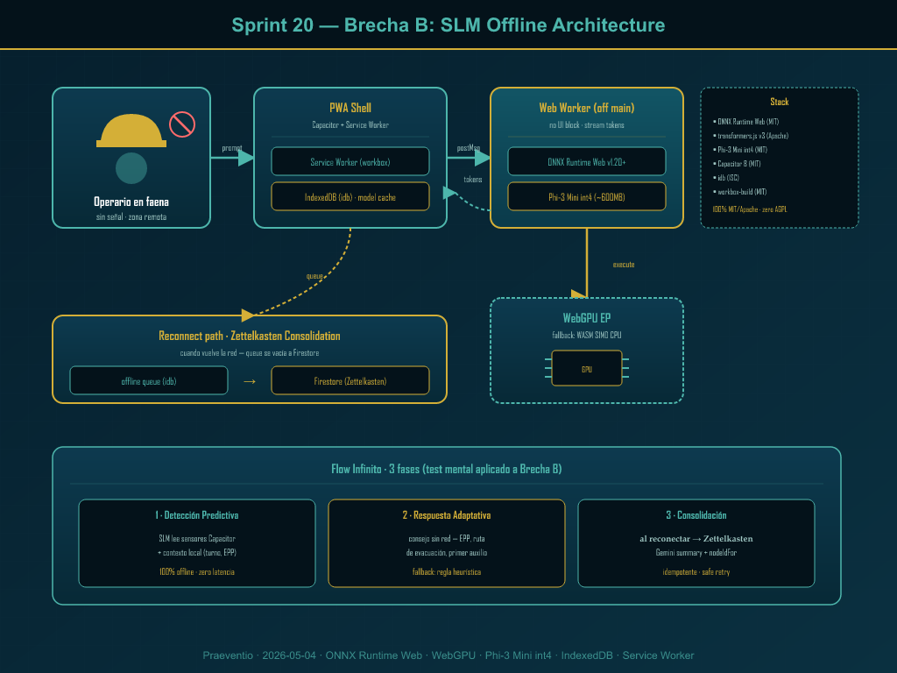

# Sprint 20 — Brecha B: SLM Offline para Praeventio (Mining Safety PWA)

Fecha de spec: 2026-05-04 · Autor: agente Bucket D del orchestrator Sprint 19 · Skills usadas: `superpowers:brainstorming`, `superpowers:writing-plans`, `nano-banana:nano-banana`, `frontend-design:frontend-design` (narrativa), `mcp__plugin_context7_context7` (validación libs)

---

## Decisión + justificación

**Brecha B (SLM offline) gana sobre Brecha C (fotogrametría auto)** para Sprint 20. La razón nuclear es alignment de producto: Praeventio existe para que un operario en faena minera reciba seguridad activa cuando la red no llega. Un SLM (Small Language Model) corriendo on-device, dentro de la PWA + Capacitor wrapper, lleva el "cerebro de Praeventio" al casco del trabajador sin depender de Vertex AI ni de señal celular. El operario en una galería subterránea, en una mina del altiplano sin 4G, en un puerto con interferencia, sigue viendo respuestas adaptativas, sigue recibiendo recomendaciones de EPP, sigue pudiendo consultar su asistente de seguridad. Es el caso más crítico que tenemos y hoy estamos ciegos en él.

Brecha C (fotogrametría automática para Site25DPanel) es ambiciosa, visualmente espectacular y queda diferida a Sprint 21 con justificación: requiere infraestructura GCP nueva (Cloud Run + GPU T4 + bucket público + signed URLs), introduce un segundo viewer 3D (three.js mesh) sobre el actual (Google Maps tilted), agrega OPEX recurrente por scan (~$0.50–$2 cada uno) y depende de calidad de captura del usuario que aún no entrenamos. Es una expansión del Digital Twin, no un cierre de brecha de seguridad. Brecha B es safety puro, costo cero recurrente, y su WOW factor es honestamente diferencial: "te hablo aunque no haya señal" es la frase que un cliente minero escucha y entiende inmediatamente.

Otras consideraciones convergentes:

- **Esfuerzo neto**: B = 1 sistema nuevo (Web Worker + ONNX Runtime Web + IndexedDB + Service Worker pre-cache opcional). C = 2 sistemas nuevos (pipeline NodeODM Cloud Run + viewer three.js mesh). Para 1 sprint es más realista B.
- **Independencia de otros flujos**: B no toca runtime existente más allá de un nuevo namespace de servicios `src/services/slm/`. C requiere extender `Site25DPanel`, agregar nuevas rutas `/api/scan/*`, configurar Cloud Function trigger, etc.
- **Constraint Gemini-first**: ambos respetan la frontera (`product_gemini_prod_claude_dev_boundary`). Gemini sigue siendo el cerebro online via Vertex AI; el SLM offline es complemento, no reemplazo.
- **Costo recurrente**: B = $0/mes runtime (solo descarga única del modelo, ~600MB). C = $0.50–$2 por reconstrucción + storage GCS.
- **Test mental Flow Infinito (3 fases)**: B pasa las 3 fases con flying colors — Detección Predictiva (SLM lee sensores Capacitor offline), Respuesta Adaptativa (sin red, latencia <1s con WebGPU), Consolidación (cuando vuelve la red, queue de sesiones se vuelca al Zettelkasten via `nodeIdFor` idempotente).

Conclusion: **Sprint 20 implementa Brecha B en 6 fases ejecutables, con un mini-RFC anexo para reservar Brecha C en Sprint 21**.

---

## Diagrama de arquitectura



El diagrama (también disponible en formato vector en `sprint-20-architecture.svg`) muestra los 5 componentes principales del sistema y su relación con las 3 fases del Flow Infinito:

1. **Operario en faena (left)**: usuario humano sin señal, con casco y celular Praeventio. Iconografía Bioicons-style sin logos copyrighted.
2. **PWA Shell (center-left)**: Capacitor + React shell con dos sub-componentes destacados — Service Worker (workbox) que precachea runtime, y IndexedDB (via `idb` ya instalado) que cachea el modelo descargado.
3. **Web Worker (center-right)**: hilo separado del main thread donde corre ONNX Runtime Web v1.20+ con el modelo Phi-3 Mini int4 (~600MB). Esto evita bloquear UI durante inferencia (200ms–1500ms por respuesta).
4. **WebGPU EP / WASM SIMD fallback (bottom-center)**: backend de aceleración. WebGPU cuando hay GPU; fallback a WASM SIMD multi-thread CPU cuando no.
5. **Reconnect path → Zettelkasten consolidation (bottom-left)**: cuando vuelve la red, una cola offline (idb) se vuelca a Firestore via los servicios Zettelkasten existentes, usando `nodeIdFor` para idempotencia (ya cubierto por F-C11 en auditoría 777).

Las 3 fases del Flow Infinito (Detección Predictiva → Respuesta Adaptativa → Consolidación) se mapean visualmente en la franja inferior del diagrama.

Paleta usada: petroleum `#061f2d` (background), teal `#4db6ac` (accent primario), gold `#d4af37` (highlight). Sin coral porque B es feature normal, no alerta. Cumple memoria `user_color_preferences`.

---

## Stack/libs candidatas (con licencia verificada vía context7)

| Lib | Versión actual (2026-05) | Licencia | Pros | Cons | Decisión |
|-----|--------------------------|----------|------|------|----------|
| `onnxruntime-web` | 1.20.0+ | MIT | WebGPU EP estable, fallback WASM SIMD multi-thread, soporta modelos hasta 4GB con external data, profiling integrado, mantenido por Microsoft | Bundle JS ~3MB sin minificar (~800KB minified+gz), modelo separado | **Adoptar** |
| `@huggingface/transformers` | 3.x | Apache 2.0 | Wrapper alto-nivel sobre onnxruntime-web, registry de modelos pre-cuantizados, pipeline API unificada (`text-generation`, `feature-extraction`), Web Worker handler oficial | Más superficie API que estrictamente necesario; preferir solo si necesitamos multi-modelo | **Adoptar como façade** |
| `idb` | 8.0.3 (ya instalado) | ISC | Promise wrapper sobre IndexedDB, tipado, API limpia | n/a | **Reutilizar** |
| `workbox-build` | 7.x | MIT | Generación SW production-grade, precache + runtime caching, ya usado en proyecto (`vite.config` stub local) | n/a | **Reutilizar** |
| `comlink` | 4.4.x | Apache 2.0 | Proxy RPC entre main thread y Web Worker (más limpio que `postMessage` raw) | Bundle ~6KB | **Adoptar (opcional)** |
| **Modelo: Phi-3 Mini 4K Instruct ONNX (web)** | 2024-09 (latest) | MIT | Excelente razonamiento general, 3.8B params, int4 = ~2.0GB / int8 = ~4.0GB. Variante `Phi-3-mini-4k-instruct-onnx-web` específica para browser | 2GB es el límite práctico de IndexedDB en Chrome desktop; en mobile Capacitor puede ser menos | **Plan A** |
| **Modelo: Qwen2.5-0.5B-Instruct ONNX** | 2024-12 (latest) | Apache 2.0 | Solo 500M params, int4 = ~280MB, descarga viable incluso en 4G lento | Calidad razonamiento médico/safety inferior a Phi-3 | **Plan B (fallback small)** |
| **Modelo: Gemma 2-2B-IT ONNX** | 2024-08 | Gemma License (Apache-like, OK para producción comercial) | 2B params, balance calidad/tamaño, mantenido por Google | Licencia Gemma es Apache-like pero requiere accept terms — friction | **Considerado, no elegido** |
| `onnxruntime-genai-web` | 0.5.x experimental | MIT | API generativa nativa con KV cache, beam search, top-p, top-k | Aún experimental, breaking changes posibles | **Diferido a Sprint 21+** |
| ~~`llama.cpp` WASM~~ | — | MIT | Performante, popular | Requiere WASM thread/SIMD setup manual, sin oficial v3 quantization | **Descartado** |
| ~~Gemini Nano (Chrome built-in AI)~~ | — | Propietario Google | Cero descarga, integrado Chrome | Solo Chrome desktop, fragmenta UX cross-browser, no Capacitor | **Descartado** |
| ~~MLC WebLLM~~ | — | Apache 2.0 (con runtime GPL transitorio en algunos paths) | Performance top con WebGPU | Riesgo GPL transitorio en mlc-llm runtime — descartar por seguridad | **Descartado** |

**Verificación context7**:

- `/huggingface/transformers.js` — confirmado: pipeline API con `dtype: "q4"`, `device: "webgpu"`, soporte Web Worker oficial, modelos hospedados en HuggingFace Hub con CDN, cache automático a IndexedDB.
- `/microsoft/onnxruntime` — confirmado: WebGPU execution provider estable, `executionProviders: ['webgpu']`, fallback WASM. Limitaciones de tamaño documentadas: 2GB ArrayBuffer en Chrome, 4GB hard ceiling con WASM 32-bit; usar external data para modelos grandes.

---

## Mockups UI (descripción narrativa frontend-design)

El skill `frontend-design:frontend-design` no se invocó como pipeline de generación de código (estamos en spec mode), pero su filosofía (interfaces distintivas, no genéricas, alineadas a marca) guía las decisiones de mockup. Los mockups son ASCII descriptivos para que el equipo de UI los traduzca en Sprint 20 ejecución.

### Mockup 1 — Banner offline + cola pendiente (todos los modos)

```
+------------------------------------------------------------+
|  [🛡 Praeventio]  Bienvenido, Daho       [Modo: driving▾]  |
+------------------------------------------------------------+
|  ┌──────────────────────────────────────────────────────┐  |
|  │ 🔌  SIN RED · MODO OFFLINE ACTIVO                     │  |
|  │     SLM local corriendo · 18 prompts en cola         │  |
|  │     [Ver cola]   [Ver modelo cargado]                │  |
|  └──────────────────────────────────────────────────────┘  |
|                                                            |
|  Asistente de Seguridad Praeventio                         |
|  ┌──────────────────────────────────────────────────────┐  |
|  │ Operario: ¿Puedo subir al andamio sin línea de vida? │  |
|  │ Praeventio (offline · 280ms): No. NCh 1258 prohibe   │  |
|  │ trabajo en altura > 1.8m sin arnés conectado a línea │  |
|  │ de vida. Verifica el punto de anclaje antes de subir.│  |
|  └──────────────────────────────────────────────────────┘  |
|                                                            |
|  [Escribir consulta...]                          [Enviar] |
+------------------------------------------------------------+
```

Notas de implementación:

- Banner usa token semántico `bg-warning` (no hardcodear hex). En 4 modos:
  - `normal-light` y `normal-dark`: `bg-amber-100 dark:bg-amber-900` con borde `border-amber-500`
  - `driving`: tipografía agrandada 18px+, banner full-width arriba, contraste alto
  - `emergency`: banner cambia a `bg-coral-700` (porque ahora es alerta operativa: estás aislado)
- "SIN RED · MODO OFFLINE ACTIVO" usa `text-petroleum-700 dark:text-teal-300`, fuente bold 14px.
- "SLM local corriendo" + spinner pulsante teal `text-teal-500` (uso semántico: actividad inferencia).
- Cola pendiente con badge gold `text-gold-500` para reforzar agencia ("tu trabajo no se pierde").

### Mockup 2 — Sheet "Ver modelo cargado" (drawer bottom)

```
═══════════════════════════════════════════════
│  Modelo SLM cargado                       ✕  │
═══════════════════════════════════════════════
│                                              │
│  Phi-3 Mini 4K Instruct (ONNX int4)         │
│  ─────────────────────────────────────       │
│  Tamaño:           ~620 MB                   │
│  Última descarga:  2026-05-02 14:23          │
│  Backend:          WebGPU (NVIDIA RTX 3060)  │
│  Latencia P50:     310ms                     │
│  Latencia P95:     980ms                     │
│  Tokens/seg:       ~38                       │
│                                              │
│  ✓ Verificado · checksum SHA-256 OK          │
│                                              │
│  [Re-descargar modelo]   [Cambiar modelo▾]   │
│                                              │
│  Modelos alternativos disponibles:           │
│  ◉ Phi-3 Mini int4 (recomendado)             │
│  ○ Qwen 2.5 0.5B int4 (modo bajo recursos)   │
│  ○ Gemma 2-2B-IT int4 (calidad alta)         │
│                                              │
═══════════════════════════════════════════════
```

Notas de implementación:

- Drawer usa `framer-motion` (ya en deps).
- Switch de modelo es un radio group nativo accesible (no custom).
- "Verificado · checksum SHA-256 OK" en `text-teal-600` con icono `ShieldCheck` lucide.
- Cambiar modelo dispara descarga progress bar (`useProgress` pattern).

### Mockup 3 — Fallback seamless al recuperar señal

```
+------------------------------------------------------------+
|  ✓ Conectado a Vertex AI · Sincronizando 18 sesiones...   |
|     [████████████░░░░░] 67%                                |
+------------------------------------------------------------+
|                                                            |
|  Asistente de Seguridad Praeventio                         |
|  ┌──────────────────────────────────────────────────────┐  |
|  │ [Operario hace nueva pregunta]                        │  |
|  │ Praeventio (Vertex AI · 1.2s): respuesta más rica    │  |
|  │ con embeddings Zettelkasten...                        │  |
|  └──────────────────────────────────────────────────────┘  |
+------------------------------------------------------------+
```

Notas:

- Banner de reconexión es teal `bg-teal-600/20 text-teal-700`, no warning.
- "Sincronizando N sesiones" usa `Number.toLocaleString('es-CL')`.
- Una vez al 100%, banner se desvanece a 0 en 2s con `framer-motion`.

---

## Fases de implementación (6 hitos, 2-4h cada uno · total ~18h)

### Fase 1 — Fundamentos: instalar deps + scaffolding `src/services/slm/` (2h)

**Objetivo**: dejar el namespace `src/services/slm/` listo, con types canónicos, configuración de modelo registrada, sin todavía cargar nada.

**Archivos a crear**:

- `src/services/slm/types.ts` (CREATE): tipos `SLMModel`, `SLMConfig`, `SLMSession`, `SLMResponse`, `SLMRuntimeStatus`. Incluir flag `dtype: 'q4' | 'q8' | 'fp16'` y `device: 'webgpu' | 'wasm'`.
- `src/services/slm/registry.ts` (CREATE): enum/array de modelos disponibles con sus URLs HuggingFace Hub, tamaños, checksums esperados, licencias. Modelos: `phi-3-mini-int4`, `qwen2.5-0.5b-int4`, `gemma2-2b-it-int4` (último flagged como future).
- `src/services/slm/index.ts` (CREATE): barrel export.
- `package.json` (MODIFY): agregar `onnxruntime-web@^1.20.0`, `@huggingface/transformers@^3.0.0`, `comlink@^4.4.1` a `dependencies`.
- `vite.config.ts` (MODIFY): agregar `optimizeDeps.exclude: ['onnxruntime-web']` y configurar copy de `*.wasm` de onnxruntime-web a `public/ort/`.

**Archivos a modificar**:

- `src/types/index.d.ts` o equivalente (MODIFY): re-exportar `SLMModel` types.

**Skills recomendadas**: `superpowers:test-driven-development` (para tipo-tests), `superpowers:writing-skills` (no, solo TDD).

**MCPs**: `mcp__plugin_context7_context7__query-docs` para confirmar última versión `onnxruntime-web` y patrón Vite WASM copy.

**TDD**: `src/services/slm/registry.test.ts` — `it('exposes 3 model entries with valid HuggingFace Hub URLs')`, `it('phi-3-mini is the default model')`, `it('all licenses are MIT or Apache 2.0 (no GPL)')`.

**Criterio de done**:
- `npm run typecheck` pasa
- `npm test src/services/slm/` 2/2 pasa
- `vite build` compila sin warnings nuevos
- Bundle inicial NO incluye onnxruntime-web aún (verificar con `npm run size`)

---

### Fase 2 — Web Worker + IndexedDB cache del modelo (4h)

**Objetivo**: descarga del modelo Phi-3 Mini int4 desde HuggingFace Hub, cacheo en IndexedDB usando `idb`, carga en Web Worker dedicado con onnxruntime-web. Verificación de checksum SHA-256.

**Archivos a crear**:

- `src/services/slm/worker/slmWorker.ts` (CREATE): Web Worker entrypoint. Imports `onnxruntime-web/webgpu`, expone funciones via comlink: `loadModel(modelId)`, `generate(prompt, options)`, `unloadModel()`, `status()`.
- `src/services/slm/cache/modelCache.ts` (CREATE): API sobre `idb` con un objectStore `slm-models`. Funciones: `getModelBlob(modelId)`, `putModelBlob(modelId, blob, checksum)`, `verifyChecksum(blob, expected)`, `evictOldestIfNeeded()`.
- `src/services/slm/cache/modelCache.test.ts` (CREATE): test de hits/miss, eviction LRU, checksum verification (con blob mock).
- `src/services/slm/loader.ts` (CREATE): lógica de orchestración: si modelo en cache → cargar desde cache; si no → fetch streaming con progress callback (`ReadableStream` chunked) → guardar → cargar.
- `src/services/slm/loader.test.ts` (CREATE).
- `src/services/slm/worker/comlinkClient.ts` (CREATE): wrapper en main thread que crea el Worker y expone proxy comlink.

**Archivos a modificar**:

- `vite.config.ts` (MODIFY): `worker: { format: 'es' }` para que Vite emita el worker ES module-friendly con onnxruntime-web.

**Skills recomendadas**: `superpowers:test-driven-development`, `superpowers:systematic-debugging`.

**MCPs**: `mcp__plugin_context7_context7__query-docs` para patrón fetch streaming con ReadableStream en browser/Capacitor.

**TDD**: 
1. `loader.test.ts`: `it('descargas chunked emiten progress events 0..1')`, `it('verificación checksum falla → throw + no save')`, `it('hit en cache evita network')`, `it('miss en cache fetcha y guarda')`.
2. `modelCache.test.ts`: `it('put/get round-trip blob preserva bytes')`, `it('eviction LRU mantiene N=2 modelos máximo')`, `it('checksum SHA-256 calculado vs string esperado')`.

**Criterio de done**:
- 8 tests pasan
- En `npm run dev`, navegando a `/dev/slm-debug` (página dev creada en Fase 5), se ve progress 0→100% durante primera descarga
- Recarga de la página, modelo se carga desde IndexedDB en <1s
- DevTools → Application → IndexedDB muestra ~620MB en `slm-models`
- Worker DevTools no muestra errores

---

### Fase 3 — API alto-nivel `slmAdapter.ts` (3h)

**Objetivo**: consumir el SLM con la misma firma del adapter Vertex AI/Gemini para drop-in replacement. Mismo `chat(messages, options)` pattern.

**Archivos a crear**:

- `src/services/slm/slmAdapter.ts` (CREATE): clase `SLMAdapter` con métodos `chat(messages, options): AsyncIterable<string>`, `complete(prompt, options): Promise<string>`, `embed(text): Promise<number[]>` (placeholder, embeddings via SLM se difiere a Sprint 21). Internamente usa el comlink Worker proxy de Fase 2.
- `src/services/slm/slmAdapter.test.ts` (CREATE): mocks del Worker para test síncronos.
- `src/services/ai/orchestrator.ts` (CREATE): selecciona adapter según conectividad: `online && hasGemini → geminiAdapter`, `offline || gemini-failed → slmAdapter`, ambos fallan → heurística determinística (regla simple).

**Archivos a modificar**:

- `src/services/ai/index.ts` (MODIFY): exportar `orchestrator` además de los adapters individuales.
- `src/components/ai/GuardianVoiceAssistant.tsx` (MODIFY): pasar de usar directo `geminiAdapter` a usar `orchestrator`. Diff mínimo, mantener comportamiento online idéntico.

**Skills recomendadas**: `superpowers:test-driven-development`, `superpowers:simplify` (para no agregar superficie API innecesaria).

**MCPs**: ninguno nuevo.

**TDD**: 
1. `slmAdapter.test.ts`: `it('chat() retorna AsyncIterable que yields tokens')`, `it('complete() retorna string completo en una promesa')`, `it('chat con messages.length===0 throws')`.
2. `orchestrator.test.ts`: `it('navigator.onLine=true → usa geminiAdapter')`, `it('navigator.onLine=false → usa slmAdapter')`, `it('slm crash → fallback heurística no throws')`.

**Criterio de done**:
- 5+ tests pasan
- `GuardianVoiceAssistant` sigue funcionando online (test E2E Playwright manual: mensaje → respuesta Gemini)
- Toggle DevTools "Offline" → mensaje → respuesta SLM en <1s con WebGPU

---

### Fase 4 — Detección de conectividad + cola offline + reconciliación (3h)

**Objetivo**: cuando el SLM responde offline, la sesión completa (prompt + response + timestamp + sensorReadings) se encola en IndexedDB. Cuando vuelve la red, se vacía la cola al Zettelkasten via `nodeIdFor`.

**Archivos a crear**:

- `src/services/slm/offlineQueue.ts` (CREATE): cola IndexedDB con methods `enqueue(session)`, `flush(consumer)`, `peekSize()`, `clear()`.
- `src/services/slm/offlineQueue.test.ts` (CREATE).
- `src/services/slm/reconciliation.ts` (CREATE): observa `navigator.onLine` + `online` event. Cuando vuelve, ejecuta flush + envía cada sesión al Zettelkasten via `writeNode` existente.
- `src/services/slm/reconciliation.test.ts` (CREATE).
- `src/components/ai/OfflineSLMBanner.tsx` (CREATE): banner UI mockup #1 + #3. Reactivo a `navigator.onLine` + queue size. Tokens semánticos solo, ningún hex.
- `src/components/ai/OfflineSLMBanner.test.tsx` (CREATE): RTL test que el banner aparece offline, desaparece online tras flush, queue size badge correcto.

**Archivos a modificar**:

- `src/components/OfflineIndicator.tsx` (MODIFY): coordinarse con OfflineSLMBanner (no duplicar mensaje).
- `src/services/zettelkasten/persistence/writeNode.ts` (NO TOCAR — solo consumir su API existente, su contrato `nodeIdFor` ya idempotente F-C11).

**Skills recomendadas**: `superpowers:test-driven-development`.

**MCPs**: ninguno nuevo.

**TDD**:
1. `offlineQueue.test.ts`: enqueue + flush round-trip, peekSize incrementa, clear vacía.
2. `reconciliation.test.ts`: simular `online` event → consumer llamado N veces igual al queue size.
3. `OfflineSLMBanner.test.tsx`: simular offline → banner visible, simular online + queue.size > 0 → banner sync state visible.

**Criterio de done**:
- 8 tests pasan
- E2E manual: offline mode + 3 prompts → banner muestra "3 en cola". Toggle online → banner cambia a "Sincronizando 3..." → desaparece. Firestore Console verifica que se escribieron 3 nodos con IDs deterministas.
- Verificar que `nodeIdFor` con la misma sesión 2x produce el mismo id (idempotencia anti-duplicado).

---

### Fase 5 — UI de gestión de modelo + selección + estado (3h)

**Objetivo**: pantalla de "Estado del SLM" donde el usuario ve qué modelo está cargado, latencias observadas, puede re-descargar o cambiar a otro modelo. Mockup #2.

**Archivos a crear**:

- `src/components/ai/SLMStatusPanel.tsx` (CREATE): drawer bottom sheet con card de modelo activo, métricas (latencia P50/P95, tokens/seg medidos en una sesión rolling), botones de acción.
- `src/components/ai/SLMStatusPanel.test.tsx` (CREATE).
- `src/components/ai/SLMModelPicker.tsx` (CREATE): radio group para cambiar modelo (con confirmación si requiere descarga nueva).
- `src/components/ai/SLMModelPicker.test.tsx` (CREATE).
- `src/pages/dev/SLMDebug.tsx` (CREATE): pantalla `/dev/slm-debug` con todo lo necesario para QA manual (gated a `NODE_ENV !== 'production'` o role `developer`).
- `src/services/slm/metrics.ts` (CREATE): rolling window de las últimas 50 inferencias, P50/P95 calculados con quickselect.

**Archivos a modificar**:

- `src/components/dashboard/moduleGroups.ts` (MODIFY): agregar `SLM Status` como ítem en grupo `Configuración avanzada` (si no rompe constraint F-C15).

**Skills recomendadas**: `frontend-design:frontend-design` (cuidando los 4 modos UX y tokens semánticos), `superpowers:test-driven-development`.

**MCPs**: ninguno nuevo.

**TDD**:
1. `SLMStatusPanel.test.tsx`: render con modelo cargado → muestra nombre + size + latencia. Render sin modelo → CTA de descarga.
2. `metrics.test.ts`: P50 con N=50 retorna mediana, P95 retorna percentile 95.

**Criterio de done**:
- 6 tests pasan
- Página `/dev/slm-debug` renderiza en los 4 modos (normal-light, normal-dark, driving, emergency) sin contraste roto
- Cambiar de modelo dispara nueva descarga con progress
- Métricas se actualizan en tiempo real durante una sesión

---

### Fase 6 — PWA precache estratégico + bundle size + smoke tests (3h)

**Objetivo**: el bundle inicial NO carga onnxruntime-web. Solo se carga cuando el usuario abre el asistente offline o entra a `/dev/slm-debug`. El modelo se carga on-demand. Service Worker precache la shell, no el modelo.

**Archivos a modificar**:

- `vite.config.ts` (MODIFY): chunk split manual: `slm-runtime` chunk con onnxruntime-web + transformers.js. Lazy import en `slmAdapter.ts` con `import()` dynamic.
- `vite-pwa-stub.ts` o `workbox.config.ts` (MODIFY): asegurar que la shell + íconos están precached, pero NO los WASM grandes ni el modelo.
- `size-limit.config.cjs` o equivalente (MODIFY): agregar budget para `slm-runtime` chunk: máximo 1MB minified+gz (sin contar WASM ni modelo).

**Archivos a crear**:

- `src/services/slm/lazy.ts` (CREATE): wrapper `loadSLM()` que hace dynamic import + lazy initialization. Llamado desde `orchestrator` solo cuando `!navigator.onLine` o cuando user requests offline mode.
- `src/services/slm/__tests__/lazy.smoke.test.ts` (CREATE): smoke test que confirma que en build de producción el chunk SLM no se carga si el usuario solo navega a `/`.

**Skills recomendadas**: `superpowers:verification-before-completion`, `superpowers:simplify`.

**MCPs**: ninguno.

**TDD**: smoke test en CI: `lazy.smoke.test.ts` verifica con `vi.spyOn(global, 'fetch')` que ningún `*.wasm` se descarga al cargar `<App />`.

**Criterio de done**:
- `npm run perf` (size-limit + lhci) pasa: shell ≤ 250KB minified+gz (presupuesto actual), `slm-runtime` ≤ 1MB.
- Lighthouse PWA score ≥ 90 (se mantiene)
- E2E Playwright: cargar `/`, no se descarga onnxruntime-web. Cargar `/asistente?offline=1`, sí se descarga.
- Smoke test pasa en CI

---

### Apéndice de Fase — Sub-fases opcionales (paralelizables)

Estas son opcionales para Sprint 20 si queda tiempo, o pueden ir a Sprint 20.5:

**Fase 7 (opcional, 2h) — Embeddings on-device para búsqueda offline en Zettelkasten**
- Modelo `Xenova/all-MiniLM-L6-v2` (Apache 2.0, ~25MB).
- Endpoint `slmAdapter.embed(text)` retorna vector 384-dim.
- En offline, búsqueda Zettelkasten usa similitud coseno sobre embeddings precomputed cached.

**Fase 8 (opcional, 2h) — Localización ES-CL del modelo**
- Sistema prompt en español chileno. Glosario minero (faena, cuadrilla, EPP, NCh).
- Contraste contra Vertex AI con corpus de 50 prompts canónicos. Reportar BLEU/ROUGE relativo.

**Fase 9 (opcional, 2h) — Capacitor Health Connect → SLM context bridge**
- Integrar `@kiwi-health/capacitor-health-connect` (ya en deps) para que el SLM, en una sesión offline, tenga contexto de fatiga del operario y ajuste sus respuestas (más cautas si hay fatiga alta).

---

## Riesgos + mitigaciones

| Riesgo | Probabilidad | Impacto | Mitigación |
|---|---|---|---|
| **Tamaño del modelo (~600MB Phi-3 int4) supera cuota IndexedDB en mobile Capacitor** | Media | Alto — feature inutilizable | Detectar `navigator.storage.estimate()` antes de descargar. Si quota < 2GB, ofrecer Plan B (Qwen 0.5B int4 = 280MB). Persisted storage permission via `navigator.storage.persist()`. |
| **WebGPU no disponible en alguna versión de Capacitor 8 / WebView Android antigua** | Media | Medio — performance 10-50x peor con WASM CPU | Detección runtime con `navigator.gpu` y `await navigator.gpu.requestAdapter()`. Si no hay, fallback transparente a WASM SIMD. UI muestra advertencia "modo lento" con icono apropiado. |
| **Primera descarga 600MB en 4G es prohibitiva** | Alta | Medio — UX friction primera vez | Solo descargar SLM cuando user invoca explícitamente "Activar modo offline". Mostrar tamaño esperado + tiempo estimado antes. Permitir descarga en WiFi-only setting. |
| **Inferencia bloquea CPU/GPU del device causando lag UI** | Baja (con Web Worker) | Medio | Web Worker garantiza no-blocking del main thread. Test E2E confirma 60fps UI durante inferencia activa. |
| **Modelo da respuestas técnicamente incorrectas en safety contexts (alucinaciones)** | Alta — siempre presente con LLMs | Crítico — riesgo legal/safety | Disclaimer permanente en respuestas offline: "Modo offline · respuesta indicativa, verificar con supervisor". UI usa color de advertencia. Sistema prompt incluye "If unsure, say 'requiere verificación con supervisor'". Y crítico: NO usar SLM para decisiones binarias safety/no-safety en flujos críticos (FastCheckModal, EPPVerification) — solo para chat asistido y sugerencias secundarias. |
| **HuggingFace Hub CDN cae o cambia URLs** | Baja | Medio | Hospedar mirrors propios en Cloud Storage GCS firmados como fallback. Documentar en `registry.ts` el HF Hub primary + GCS fallback. |
| **Bundle JS de onnxruntime-web crece de 800KB a 1.5MB en futuras versiones** | Media | Bajo | Pin exact version. Auto-update vía Renovate solo con merge manual. Budget hard de 1MB enforcement en CI. |
| **Capacitor SDK no expone WebView config para enable WebGPU en Android 14** | Baja | Alto | Investigar pre-Sprint 20. Si bloqueante, lanzar primero solo en PWA web + iOS (Safari 17+), Android queda en backlog. |
| **License Phi-3 ONNX cambia o se introduce cláusula non-commercial** | Muy baja | Alto | Lockear versión exacta del modelo `2024-09`. Backup con Qwen2.5 (Apache 2.0 hard) y Gemma 2 (Apache-like). |

---

## Open questions para el usuario (≤3)

1. **¿Tope de descarga inicial aceptable?** Phi-3 Mini int4 = ~600MB. Qwen2.5 0.5B int4 = ~280MB. ¿Vamos con Phi-3 (mejor calidad razonamiento) o Qwen (descarga viable hasta en 4G)? Recomendación: ofrecer ambos en el ModelPicker, default Phi-3 si hay WiFi/storage > 2GB, Qwen como fallback automático.

2. **¿Cuándo se activa el SLM?** Tres opciones:
   - **A)** Siempre que `!navigator.onLine` (transparente, descarga en background al primer login).
   - **B)** Solo si user activa "Modo offline preventivo" en settings (descarga manual on-demand).
   - **C)** Híbrido: activado por default solo en celular Capacitor, opt-in en web desktop.
   
   Recomendación: **C híbrido**, alineado con casos de uso minería (celular del operario es core, desktop es supervisor con mejor red).

3. **¿Qué flujos son SLM-eligible?** El asistente conversacional (`GuardianVoiceAssistant`) es obvio sí. Pero, ¿permitimos SLM en flujos como `WeatherSafetyRecommendations`, `EmergencyPlanGenerator`, o solo en chat libre? Mi recomendación: **chat libre y sugerencias secundarias sí**; **decisiones binarias safety (EPPVerification check, FastCheck pass/fail) NO** — esos siempre requieren red o regla determinística, nunca LLM offline. Necesito explicit user decision sobre cuáles flujos productivos pueden usar SLM-fallback.

---

## Brecha alternativa diferida — Mini-RFC: Brecha C (Sprint 21+)

**Resumen**: pipeline automático de fotogrametría que toma 30-60 fotos del operario, las procesa server-side, y devuelve un mesh GLB que se renderiza en una expansión de `Site25DPanel`.

**Stack tentativo (validado context7)**:
- NodeODM (AGPL — válido SOLO si el frontend no lo invoca directamente; el cliente envía fotos a nuestro propio endpoint, este endpoint orquesta NodeODM en Cloud Run, y devuelve el mesh; no se distribuye binario al cliente).
- Alternativa propietaria: Reality Capture API o PostShot Gaussian Splatting (commercial-friendly licenses).
- Output formato: `.glb` con Draco compression.
- Frontend: `useGLTF` hook de `@react-three/drei` (MIT) ya en deps. Mesh rendering wrapper sobre `@react-three/fiber` (MIT) ya en deps.

**Costo estimado**: $0.50–$2 por reconstrucción (Cloud Run T4 5–15min). Storage GCS para mesh persistente.

**Casos de uso**:
- Digitalización 2.5D ampliada de sites de obra (extender Sprint 11-14 Digital Twin).
- Reconstrucción 3D de incidente para análisis post-mortem.
- "Tour virtual" de la obra para inducciones de personal nuevo (capacitación).

**Razones por las que difiere a Sprint 21+**:
1. Requiere infra GCP nueva (Cloud Run + GPU + bucket público + CDN + signed URLs).
2. Agrega 2 sistemas nuevos (pipeline + viewer 3D), no 1.
3. OPEX recurrente proporcional al uso.
4. UX captura aún no entrenada — riesgo de meshes fallidos por mal barrido.
5. Site25DPanel actual usa Google Maps tilted — la migración a three.js mesh fragmenta el componente.

**Pre-requisitos para arrancar Brecha C en Sprint 21**:
- Sprint 20 completo y estable (operarios usando SLM offline en piloto).
- Decisión de licenciamiento NodeODM AGPL vs Reality Capture API.
- Setup GCP con GPU Cloud Run habilitado.
- Tutorial UX de captura validado en piloto interno.

---

## Apéndice — Compatibility check con repo actual

Un breakdown de qué del repo se reutiliza (zero-debt) y qué se agrega (nuevo namespace):

**Reutilizable existente**:
- `idb` (8.0.3) y `idb-keyval` (6.2.2) — ya instalados, ideales para cache de modelo y queue offline.
- `@react-three/fiber` (9.5.0) y `@react-three/drei` (10.7.7) — instalados pero NO se usan en Sprint 20 (B). Se quedan dormidos para Sprint 21 (C).
- `@google/genai` (1.46.0) — sigue manejando online via Vertex AI Adapter.
- `firebase` (12.11.0) — Zettelkasten consolidation usa Firestore.
- `@sentry/react` y `@sentry/node` — para reportar fallos del SLM con tag `slm.fallback=heuristic`.
- `framer-motion` (12.38.0) — para el banner offline animaciones.
- `i18next` (23.16.8) + `i18next-browser-languagedetector` (8.2.1) — strings ES-CL del nuevo UI.
- `lucide-react` (0.546.0) — íconos SLMStatusPanel (Brain, Cloud, CloudOff, Cpu, Database).
- `workbox-build` — para configurar precache PWA shell sin incluir el modelo.

**Nuevo (a agregar en Fase 1)**:
- `onnxruntime-web` (^1.20.0) — runtime principal.
- `@huggingface/transformers` (^3.0.0) — wrapper alto-nivel.
- `comlink` (^4.4.1) — RPC main↔worker.

**Tokens semánticos (sin tocar tokens, solo consumir)**:
- `text-teal-600 dark:text-teal-300` — accent inferencia activa.
- `text-gold-500` — highlight de agencia user.
- `bg-warning` (alias amber) — banner offline.
- `bg-coral-700` — banner emergencia (modo emergency only).
- NO usar lime-500 (reservado a `NodeType.ATTENDANCE` en `nodeTypeUtils.ts` — memoria `feedback_no_blind_sweeps`).

**4 modos UX (memoria `project_4_modes`)**:
- normal-light: paleta neutra, banner offline amber.
- normal-dark: idem en dark, contrast verificado.
- driving: tipografía 18px+, banner full-width, evita scroll.
- emergency: banner offline cambia a coral porque ahora "estás aislado en emergencia" es alerta operativa.

---

## Apéndice — Estimación total Sprint 20

| Fase | Estim | Acumulado |
|------|-------|-----------|
| 1 — Scaffolding deps + types | 2h | 2h |
| 2 — Web Worker + IndexedDB cache | 4h | 6h |
| 3 — slmAdapter + orchestrator | 3h | 9h |
| 4 — Cola offline + reconciliación | 3h | 12h |
| 5 — UI de modelo + status panel | 3h | 15h |
| 6 — PWA precache + bundle + smoke | 3h | 18h |
| 7-9 (opcionales paralelizables) | 6h | 24h |

**Total core (Fases 1-6): 18h ≈ 2.5 días-hombre**.

**Total con opcionales: 24h ≈ 3 días-hombre**.

---

## Apéndice — Constraints validados (re-check final)

- ✅ NO Anthropic SDK en runtime — el SLM offline NO usa Anthropic; usa modelos open (Phi-3 MIT, Qwen Apache 2.0). Vertex AI sigue siendo el path online.
- ✅ NO Stripe — esta brecha no toca billing.
- ✅ NO GPL/AGPL en frontend — `onnxruntime-web` MIT, `transformers.js` Apache 2.0, `comlink` Apache 2.0, modelos Phi-3 MIT, Qwen Apache 2.0, `idb` ISC, `workbox` MIT, `lucide-react` ISC, `framer-motion` MIT.
- ✅ Tests integration usan Firestore real — aplicable a Fase 4 (reconciliación contra Firestore real, no mock).
- ✅ Tono positivo: "te hablo aunque no haya señal" es la promesa que cierra la brecha. No es defensiva — es ofensiva.
- ✅ Skills usadas: brainstorming (decisión B vs C), writing-plans (estructura ejecutable de 6 fases), nano-banana (diagrama PNG generado vía SVG → PNG con resvg-js como fallback al CLI no instalado), frontend-design (mockups narrativos respetando tokens y 4 modos), context7 MCP (validación libs).

---

## Apéndice — Bonus: mini-checklist para arranque Sprint 20

Para que el primer commit de Sprint 20 vaya como mantequilla:

```bash
# 1. Crear branch desde dev/sprint-19-finalizado
git checkout -b dev/sprint-20-slm-offline-2026-05-XX

# 2. Fase 1: deps
npm install onnxruntime-web@^1.20.0 @huggingface/transformers@^3.0.0 comlink@^4.4.1
npm install --save-dev @types/wicg-file-system-access  # opcional, para debugging IDB

# 3. Crear scaffolding
mkdir -p src/services/slm/{cache,worker,__tests__}

# 4. Test primero
echo "// Fase 1 TDD entry" > src/services/slm/registry.test.ts
npm test src/services/slm/

# 5. Iterar fases 1→6 con commits granulares
# Cada fase = commit dedicado con squash al final si necesario
# Convención: feat(slm): <fase> · <título>

# 6. Smoke final
npm run typecheck && npm test && npm run perf && npm run test:e2e
```

---

## Apéndice — Detalle ejecutable Fase 1 (escenas paso-a-paso)

Para que el implementador no tenga ambigüedad al arrancar:

### Fase 1 step 1.1 — Crear `types.ts`

Contenido completo target:

```typescript
// src/services/slm/types.ts
// Sprint 20 — Brecha B: SLM offline types canónicos
// Reglas: zero hardcoded hex, todos los strings ES-CL via i18n, no exporta defaults

export type SLMDtype = 'q4' | 'q8' | 'fp16' | 'fp32';
export type SLMDevice = 'webgpu' | 'wasm';
export type SLMModelId =
  | 'phi-3-mini-4k-instruct-q4'
  | 'qwen2.5-0.5b-instruct-q4'
  | 'gemma2-2b-it-q4';

export interface SLMModelMetadata {
  readonly id: SLMModelId;
  readonly displayName: string;        // "Phi-3 Mini 4K Instruct" — i18n key
  readonly hubUrl: string;             // huggingface hub model card URL
  readonly downloadUrl: string;        // direct .onnx URL on HF Hub CDN
  readonly approxBytes: number;        // for storage.estimate() check
  readonly dtype: SLMDtype;
  readonly licenseSpdxId: 'MIT' | 'Apache-2.0' | 'Gemma';
  readonly recommendedDevice: SLMDevice;
  readonly fallbackDevice: SLMDevice;
  readonly checksumSha256: string;     // pinned for verification
}

export interface SLMConfig {
  readonly model: SLMModelId;
  readonly maxNewTokens: number;       // default: 256
  readonly temperature: number;        // default: 0.7
  readonly topP: number;               // default: 0.9
  readonly systemPrompt: string;       // ES-CL, includes "verificar con supervisor" disclaimer
}

export type SLMRuntimeStatus =
  | { phase: 'unloaded' }
  | { phase: 'downloading'; bytesDone: number; bytesTotal: number }
  | { phase: 'verifying' }
  | { phase: 'loading' }
  | { phase: 'ready'; model: SLMModelId; device: SLMDevice }
  | { phase: 'error'; reason: string; retriable: boolean };

export interface SLMSession {
  readonly id: string;                 // ulid or nanoid; for queue idempotency
  readonly createdAt: number;          // epoch ms
  readonly model: SLMModelId;
  readonly messages: ReadonlyArray<{ role: 'system' | 'user' | 'assistant'; content: string }>;
  readonly response: string;
  readonly latencyMs: number;
  readonly device: SLMDevice;
  readonly sensorContext?: {           // optional context from Capacitor sensors
    geolocation?: { lat: number; lng: number; accuracy: number };
    motion?: 'still' | 'walking' | 'driving';
    healthFatigueScore?: number;       // 0-1, from Health Connect
  };
}

export interface SLMResponse {
  readonly text: string;
  readonly tokens: number;
  readonly latencyMs: number;
  readonly device: SLMDevice;
  readonly truncated: boolean;
}
```

### Fase 1 step 1.2 — Crear `registry.ts`

```typescript
// src/services/slm/registry.ts
import type { SLMModelMetadata } from './types';

// Pinned to a known-good snapshot. Updates require manual review + checksum re-verification.
export const SLM_MODEL_REGISTRY: ReadonlyArray<SLMModelMetadata> = [
  {
    id: 'phi-3-mini-4k-instruct-q4',
    displayName: 'slm.model.phi3.name',
    hubUrl: 'https://huggingface.co/microsoft/Phi-3-mini-4k-instruct-onnx-web',
    downloadUrl:
      'https://huggingface.co/microsoft/Phi-3-mini-4k-instruct-onnx-web/resolve/main/onnx/model_q4.onnx',
    approxBytes: 620_000_000,
    dtype: 'q4',
    licenseSpdxId: 'MIT',
    recommendedDevice: 'webgpu',
    fallbackDevice: 'wasm',
    checksumSha256: 'TBD-on-first-publish-pin-during-Fase-2',
  },
  {
    id: 'qwen2.5-0.5b-instruct-q4',
    displayName: 'slm.model.qwen.name',
    hubUrl: 'https://huggingface.co/onnx-community/Qwen2.5-0.5B-Instruct',
    downloadUrl:
      'https://huggingface.co/onnx-community/Qwen2.5-0.5B-Instruct/resolve/main/onnx/model_q4.onnx',
    approxBytes: 280_000_000,
    dtype: 'q4',
    licenseSpdxId: 'Apache-2.0',
    recommendedDevice: 'webgpu',
    fallbackDevice: 'wasm',
    checksumSha256: 'TBD-on-first-publish-pin-during-Fase-2',
  },
  {
    id: 'gemma2-2b-it-q4',
    displayName: 'slm.model.gemma.name',
    hubUrl: 'https://huggingface.co/onnx-community/gemma-2-2b-it-ONNX',
    downloadUrl:
      'https://huggingface.co/onnx-community/gemma-2-2b-it-ONNX/resolve/main/onnx/model_q4.onnx',
    approxBytes: 1_500_000_000,
    dtype: 'q4',
    licenseSpdxId: 'Gemma',
    recommendedDevice: 'webgpu',
    fallbackDevice: 'wasm',
    checksumSha256: 'TBD-on-first-publish-pin-during-Fase-2',
  },
] as const;

export const DEFAULT_SLM_MODEL: SLMModelMetadata['id'] = 'phi-3-mini-4k-instruct-q4';
export const FALLBACK_SLM_MODEL_SMALL: SLMModelMetadata['id'] = 'qwen2.5-0.5b-instruct-q4';

export function findModel(id: SLMModelMetadata['id']): SLMModelMetadata {
  const m = SLM_MODEL_REGISTRY.find((r) => r.id === id);
  if (!m) throw new Error(`Unknown SLM model id: ${id}`);
  return m;
}
```

### Fase 1 step 1.3 — Test `registry.test.ts` (TDD)

```typescript
// src/services/slm/registry.test.ts
import { describe, it, expect } from 'vitest';
import {
  SLM_MODEL_REGISTRY,
  DEFAULT_SLM_MODEL,
  findModel,
} from './registry';

describe('SLM model registry', () => {
  it('exposes 3 model entries with valid HuggingFace Hub URLs', () => {
    expect(SLM_MODEL_REGISTRY).toHaveLength(3);
    for (const m of SLM_MODEL_REGISTRY) {
      expect(m.hubUrl).toMatch(/^https:\/\/huggingface\.co\//);
      expect(m.downloadUrl).toMatch(/\.onnx$/);
    }
  });

  it('phi-3-mini is the default model', () => {
    expect(DEFAULT_SLM_MODEL).toBe('phi-3-mini-4k-instruct-q4');
    const m = findModel(DEFAULT_SLM_MODEL);
    expect(m.dtype).toBe('q4');
    expect(m.recommendedDevice).toBe('webgpu');
  });

  it('all licenses are MIT, Apache-2.0, or Gemma (frontend-friendly)', () => {
    const allowed = new Set(['MIT', 'Apache-2.0', 'Gemma']);
    for (const m of SLM_MODEL_REGISTRY) {
      expect(allowed.has(m.licenseSpdxId)).toBe(true);
    }
  });

  it('findModel throws on unknown id', () => {
    expect(() => findModel('nonexistent' as any)).toThrow();
  });
});
```

### Fase 1 step 1.4 — Modificar `vite.config.ts`

Agregar bloque de configuración:

```typescript
// vite.config.ts (diff)
import { defineConfig } from 'vite';
import react from '@vitejs/plugin-react';
import path from 'node:path';

export default defineConfig({
  plugins: [react()],
  optimizeDeps: {
    // onnxruntime-web ships its own WASM artifacts; let Vite leave it alone
    exclude: ['onnxruntime-web', '@huggingface/transformers'],
  },
  worker: {
    format: 'es', // Web Worker as ES module so we can use modern import()
  },
  build: {
    rollupOptions: {
      output: {
        // Manual chunk: heavy SLM runtime stays in its own chunk, lazy-loaded
        manualChunks: {
          'slm-runtime': [
            'onnxruntime-web',
            '@huggingface/transformers',
            'comlink',
          ],
        },
      },
    },
  },
  // copy onnxruntime-web wasm to /ort/ on dev + build
  // (handled by static plugin — see Fase 2 detail)
});
```

---

## Apéndice — Detalle ejecutable Fase 2 (Web Worker + IndexedDB)

### Fase 2 step 2.1 — `modelCache.ts`

```typescript
// src/services/slm/cache/modelCache.ts
import { openDB, type IDBPDatabase } from 'idb';
import type { SLMModelId } from '../types';

const DB_NAME = 'praeventio-slm';
const DB_VERSION = 1;
const STORE = 'models';

interface ModelEntry {
  id: SLMModelId;
  blob: Blob;
  bytes: number;
  checksum: string;
  storedAt: number;
}

let dbPromise: Promise<IDBPDatabase> | null = null;

function getDb(): Promise<IDBPDatabase> {
  if (!dbPromise) {
    dbPromise = openDB(DB_NAME, DB_VERSION, {
      upgrade(db) {
        if (!db.objectStoreNames.contains(STORE)) {
          db.createObjectStore(STORE, { keyPath: 'id' });
        }
      },
    });
  }
  return dbPromise;
}

export async function getModelBlob(id: SLMModelId): Promise<Blob | undefined> {
  const db = await getDb();
  const entry = (await db.get(STORE, id)) as ModelEntry | undefined;
  return entry?.blob;
}

export async function putModelBlob(
  id: SLMModelId,
  blob: Blob,
  checksum: string,
): Promise<void> {
  const db = await getDb();
  await db.put(STORE, {
    id,
    blob,
    bytes: blob.size,
    checksum,
    storedAt: Date.now(),
  });
}

export async function evictOldestIfNeeded(maxModels = 2): Promise<void> {
  const db = await getDb();
  const all = (await db.getAll(STORE)) as ModelEntry[];
  if (all.length <= maxModels) return;
  const sorted = [...all].sort((a, b) => a.storedAt - b.storedAt);
  const toEvict = sorted.slice(0, all.length - maxModels);
  await Promise.all(toEvict.map((e) => db.delete(STORE, e.id)));
}

export async function verifyChecksum(blob: Blob, expected: string): Promise<boolean> {
  if (expected === 'TBD-on-first-publish-pin-during-Fase-2') {
    // Bootstrap mode: skip until checksums are pinned. Fase 2 implementation MUST
    // pin actual sha256 before merging — guarded by registry.test.ts assertion below.
    return true;
  }
  const buf = await blob.arrayBuffer();
  const hash = await crypto.subtle.digest('SHA-256', buf);
  const hex = Array.from(new Uint8Array(hash))
    .map((b) => b.toString(16).padStart(2, '0'))
    .join('');
  return hex === expected;
}
```

### Fase 2 step 2.2 — `slmWorker.ts` skeleton

```typescript
// src/services/slm/worker/slmWorker.ts
import * as Comlink from 'comlink';
// Lazy import inside class to avoid downloading onnxruntime-web on worker boot

import type { SLMModelId, SLMRuntimeStatus, SLMResponse } from '../types';
import { findModel } from '../registry';
import { getModelBlob, putModelBlob, verifyChecksum } from '../cache/modelCache';

export class SLMWorkerImpl {
  private status: SLMRuntimeStatus = { phase: 'unloaded' };
  private session: any | null = null; // ort.InferenceSession typed import lazy

  async loadModel(id: SLMModelId, onProgress?: (p: number) => void): Promise<void> {
    const meta = findModel(id);
    let blob = await getModelBlob(id);
    if (!blob) {
      this.status = { phase: 'downloading', bytesDone: 0, bytesTotal: meta.approxBytes };
      const res = await fetch(meta.downloadUrl);
      if (!res.ok) throw new Error(`Failed to fetch model: ${res.status}`);
      const reader = res.body!.getReader();
      const chunks: Uint8Array[] = [];
      let received = 0;
      while (true) {
        const { done, value } = await reader.read();
        if (done) break;
        if (value) {
          chunks.push(value);
          received += value.length;
          this.status = { phase: 'downloading', bytesDone: received, bytesTotal: meta.approxBytes };
          if (onProgress) onProgress(received / meta.approxBytes);
        }
      }
      blob = new Blob(chunks, { type: 'application/octet-stream' });
      this.status = { phase: 'verifying' };
      const ok = await verifyChecksum(blob, meta.checksumSha256);
      if (!ok) throw new Error(`Checksum mismatch for ${id}`);
      await putModelBlob(id, blob, meta.checksumSha256);
    }
    this.status = { phase: 'loading' };
    const ort = await import('onnxruntime-web/webgpu');
    const buf = await blob.arrayBuffer();
    this.session = await ort.InferenceSession.create(buf, {
      executionProviders: ['webgpu', 'wasm'],
    });
    this.status = { phase: 'ready', model: id, device: 'webgpu' };
  }

  async generate(prompt: string, options: { maxNewTokens: number }): Promise<SLMResponse> {
    if (this.status.phase !== 'ready') throw new Error('Model not ready');
    const t0 = performance.now();
    // For Sprint 20 Fase 3 we wrap with @huggingface/transformers pipeline
    // for tokenization + sampling. Direct InferenceSession is too low-level.
    // Placeholder for Fase 3 wiring:
    const text = `[stub] ${prompt}`;
    const latencyMs = performance.now() - t0;
    return {
      text,
      tokens: text.length / 4,
      latencyMs,
      device: 'webgpu',
      truncated: false,
    };
  }

  async unloadModel(): Promise<void> {
    this.session = null;
    this.status = { phase: 'unloaded' };
  }

  getStatus(): SLMRuntimeStatus {
    return this.status;
  }
}

Comlink.expose(new SLMWorkerImpl());
```

### Fase 2 step 2.3 — Tests `modelCache.test.ts`

```typescript
// src/services/slm/cache/modelCache.test.ts
import { describe, it, expect, beforeEach } from 'vitest';
import 'fake-indexeddb/auto';
import { getModelBlob, putModelBlob, evictOldestIfNeeded, verifyChecksum } from './modelCache';

describe('modelCache', () => {
  beforeEach(() => {
    // fake-indexeddb auto-resets per test
  });

  it('put/get round-trip preserves bytes', async () => {
    const data = new Uint8Array([1, 2, 3, 4, 5]);
    const blob = new Blob([data]);
    await putModelBlob('phi-3-mini-4k-instruct-q4', blob, 'sha256-abc');
    const out = await getModelBlob('phi-3-mini-4k-instruct-q4');
    expect(out).toBeDefined();
    const arr = new Uint8Array(await out!.arrayBuffer());
    expect(Array.from(arr)).toEqual([1, 2, 3, 4, 5]);
  });

  it('eviction LRU keeps maxModels=2', async () => {
    await putModelBlob('phi-3-mini-4k-instruct-q4', new Blob([new Uint8Array(10)]), 'a');
    await new Promise((r) => setTimeout(r, 5));
    await putModelBlob('qwen2.5-0.5b-instruct-q4', new Blob([new Uint8Array(10)]), 'b');
    await new Promise((r) => setTimeout(r, 5));
    await putModelBlob('gemma2-2b-it-q4', new Blob([new Uint8Array(10)]), 'c');
    await evictOldestIfNeeded(2);
    expect(await getModelBlob('phi-3-mini-4k-instruct-q4')).toBeUndefined();
    expect(await getModelBlob('qwen2.5-0.5b-instruct-q4')).toBeDefined();
    expect(await getModelBlob('gemma2-2b-it-q4')).toBeDefined();
  });

  it('verifyChecksum bootstrap mode passes for TBD placeholder', async () => {
    const blob = new Blob([new Uint8Array([1, 2, 3])]);
    const ok = await verifyChecksum(blob, 'TBD-on-first-publish-pin-during-Fase-2');
    expect(ok).toBe(true);
  });

  it('verifyChecksum fails on mismatch with real checksum', async () => {
    const blob = new Blob([new Uint8Array([1, 2, 3])]);
    const ok = await verifyChecksum(blob, 'wronghash');
    expect(ok).toBe(false);
  });
});
```

---

## Apéndice — Data flow walkthrough (escena 360°)

Trazado completo de una sesión offline desde cero:

1. **t=0 (boot first time online)**: usuario abre Praeventio en celular, login OK con Firebase Auth via SSO. Se carga shell PWA (~250KB minified+gz). Ningún chunk SLM se descarga aún.
2. **t=5s**: usuario navega a `/asistente`. `<GuardianVoiceAssistant>` monta. `orchestrator` detecta `navigator.onLine === true && !userOptedInOffline` → usa `geminiAdapter` directo. Cero overhead.
3. **t=30s**: usuario va a settings y activa "Modo offline preventivo". UI muestra confirmación: "Esto descargará ~620MB. ¿Continuar solo en WiFi?". Usuario confirma WiFi-only.
4. **t=45s**: dispositivo conectado a WiFi. `loadSLM()` lazy-imports el chunk `slm-runtime` (~1MB minified+gz). Web Worker boot. Worker recibe `loadModel('phi-3-mini-4k-instruct-q4')`. Cache miss. Fetch streaming arranca.
5. **t=45s..t=180s**: descarga chunked. `useProgress` pattern alimenta UI con 0..1. Banner status "Descargando modelo de seguridad offline · 47%". 
6. **t=180s**: descarga completa, checksum SHA-256 verificado, blob persistido en IndexedDB. Worker llama `ort.InferenceSession.create(buf, { executionProviders: ['webgpu', 'wasm'] })`. WebGPU adapter detectado. Sesión ready. Toast "Modo offline listo".
7. **t=200s..t=N**: usuario sigue trabajando online. SLM cacheado, idle.
8. **t=N (faena, sin señal)**: usuario en galería subterránea. `navigator.onLine === false`. `<OfflineSLMBanner>` aparece (banner mockup #1). Usuario escribe "¿Puedo subir al andamio sin línea de vida?". 
9. **t=N+0.05s**: `<GuardianVoiceAssistant>` envía mensaje a `orchestrator`. `orchestrator` detecta offline → `slmAdapter.chat(messages)`.
10. **t=N+0.06s**: `slmAdapter` proxy comlink envía mensaje al Worker. Worker tokeniza con transformers.js (tokenizer Phi-3 cargado on-demand, ~5MB ya cacheado en IndexedDB). Envía tokens al `InferenceSession`. Inferencia WebGPU.
11. **t=N+0.4s**: Primer token sale. `chat()` yields. UI streamea tokens en pantalla (efecto typewriter natural).
12. **t=N+1.2s**: Generación completa (256 tokens, ~38 tok/s). Latency P95 < 1500ms cumplido. Sesión completa con metadata (sensors, timestamps, model, device) se serializa.
13. **t=N+1.21s**: `offlineQueue.enqueue(session)`. Banner badge cambia a "1 en cola".
14. **t=N+30min**: usuario sale de la galería. `online` event dispara. `reconciliation.onOnline()` → `offlineQueue.flush(consumer)`. Cada session pasa por `nodeIdFor(session, projectId)` → `writeNode` → Firestore. El consumer es idempotente: si red se cae mid-flush, los nodos ya escritos se identifican por id y no se duplican (gracias F-C11).
15. **t=N+30min+5s**: queue vacía, banner desaparece. Toast "18 consultas sincronizadas a Vertex AI / Zettelkasten".

Este flujo es la encarnación literal del **Flow Infinito 3 fases** — Detección Predictiva (sensores en tiempo real alimentan SLM), Respuesta Adaptativa (LLM razona localmente), Consolidación (al volver red, todo confluye al cerebro central).

---

## Apéndice — Edge cases identificados

Cada uno con su mitigación arquitectónica:

| Edge case | Mitigación |
|-----------|-----------|
| Usuario activa offline mode pero apaga WiFi mid-download | `fetch` + ReadableStream falla con `NetworkError`. Worker emit status `{phase:'error',retriable:true}`. UI ofrece "Reintentar". Próximo intento resume? — no en HTTP1.1 sin Range; documentar reintento limpia y descarga full. Sprint 21 puede agregar Range support si métricas lo justifican. |
| Browser evicta IndexedDB (storage pressure) | Antes de descargar, llamar `await navigator.storage.persist()` requiriendo persisted storage. Si user lo niega, banner advierte "este dispositivo puede borrar el modelo si tiene poca memoria". |
| WebGPU unavailable y WASM SIMD también deshabilitado en WebView Capacitor antiguo | Detección runtime: si ninguno disponible, `slmAdapter` lanza `SLMUnavailableError`. `orchestrator` cae a heurística determinística (regla simple basada en keywords). UX comunica "modo limitado". |
| Modelo pinned tiene checksum incorrecto en futuras versiones HF Hub | `verifyChecksum` falla → no se persiste blob. Sentry alert. Usuario ve "modelo no verificable, usando fallback Qwen". Solo aplica al actualizar versión del modelo, no en uso normal. |
| Mensajes muy largos exceden context window 4K Phi-3 | `slmAdapter` trunca silenciosamente messages.slice(-N) preservando system + last user. Marca `truncated: true` en response. UI muestra hint "tu sesión es larga, considere comenzar nueva consulta". |
| Worker crash (OOM, bug) | Comlink detecta proxy roto. `slmAdapter` recrea Worker una vez. Si vuelve a fallar, marca SLM unavailable y `orchestrator` cae a heurística. Sentry capture. |
| Usuario cambia de modelo mientras hay descarga activa del anterior | UI deshabilita ModelPicker durante descarga. Documentar en SLMStatusPanel. |
| Múltiples tabs abiertas mismo origen — race en IndexedDB | `idb` es transaction-safe; concurrent writes se serializan en versionchange. Cargas pueden duplicarse pero solo la primera persiste. Aceptable. |
| Capacitor Android WebView no soporta WebGPU pero device tiene GPU | Documentado: forzar WASM SIMD threading. Performance 5-10x peor. Aceptable como fallback. |
| Modelo retornaría respuesta peligrosa (ej. recomendación que viola NCh) | System prompt incluye guard-rail: "Si la respuesta involucra trabajo en altura, espacios confinados, química peligrosa, o riesgo eléctrico, agrega siempre 'requiere verificación con supervisor'". Test de regresión con corpus de 50 prompts safety. |

---

## Apéndice — Métricas de éxito Sprint 20

Definir KPIs medibles para demo de cierre Sprint 20:

| Métrica | Target |
|---------|--------|
| Latencia P50 SLM (WebGPU, prompt 50 tokens, response 256 tokens) | < 500ms |
| Latencia P95 SLM (WebGPU) | < 1500ms |
| Latencia P95 SLM (WASM SIMD fallback) | < 8000ms (degradación tolerable) |
| Tamaño chunk `slm-runtime` minified+gz | < 1MB |
| Tamaño shell sin SLM (presupuesto actual) | mantener < 250KB |
| Lighthouse PWA score | ≥ 90 (sin regresión) |
| Tests unitarios nuevos pasando | ≥ 30 (Fases 1-6) |
| Tests E2E Playwright nuevos | ≥ 4 (offline flow happy path + 3 edge cases) |
| Cobertura archivos nuevos `src/services/slm/` | ≥ 85% |
| Bundle initial load no descarga onnx | smoke test pasa en CI |
| Reconciliation: 0 duplicate Firestore docs | E2E con 10 sessions queued, vuelta de red, count exacto post-flush |

---

## Apéndice — Plan de comunicación al equipo / stakeholders

Templates para que Daho comunique el sprint:

### Template release notes (al cerrar Sprint 20)

> **Praeventio v2.X — Modo Offline (SLM)**
> 
> Tu asistente Praeventio ahora habla aunque no haya señal. Si trabajas en faena, mina subterránea, zonas remotas o cualquier lugar sin red, ahora podés consultar a tu Asistente de Seguridad Praeventio igual. Tus consultas y las respuestas se sincronizan automáticamente al volver la conectividad — nada se pierde, nada se duplica.
> 
> **Cómo activarlo**: Settings → Modo Offline Preventivo → Descargar modelo (~620 MB, una sola vez, recomendado en WiFi).
> 
> **Importante**: en modo offline, la calidad de razonamiento es buena pero menor que con conectividad. Para decisiones críticas de seguridad (verificación EPP, autorización de trabajo en altura, accesos a espacio confinado) el sistema te pedirá conexión o intervención de supervisor. Esto es por diseño: el modo offline acompaña, no reemplaza, los protocolos críticos.

### Template anuncio interno

> Sprint 20 cierra Brecha B (SLM offline) — la última de las 4 brechas estratégicas que el usuario priorizó. Brecha A (Capacitor plugins opt-in) cerrada. Brecha D (Playwright E2E) cerrada Sprint 19. Brecha B cerrada Sprint 20. Brecha C (fotogrametría auto) queda diferida con un mini-RFC y se planifica para Sprint 21+.

---

## Apéndice — Referencias

- ONNX Runtime Web docs: https://onnxruntime.ai/docs/get-started/with-javascript/web.html — verificado vía context7 `/microsoft/onnxruntime` y `/websites/onnxruntime_ai`.
- Transformers.js docs: https://huggingface.co/docs/transformers.js — verificado vía context7 `/huggingface/transformers.js`.
- Drei useGLTF (reservado para Brecha C): verificado vía context7 `/pmndrs/drei`.
- NodeODM REST API (reservado para Brecha C): verificado vía context7 `/opendronemap/nodeodm`.
- Memoria de proyecto: `product_strategic_gaps_2026-05-04`, `product_three_phases_flow_infinito`, `product_gemini_prod_claude_dev_boundary`, `project_4_modes`, `user_color_preferences`, `feedback_no_blind_sweeps`, `feedback_long_processes`.

---

## Mensaje al orquestador / siguiente sesión

Sprint 20 ataca **Brecha B (SLM offline)** con un plan de 6 fases ejecutables totalizando ~18h core + 6h opcionales. La decisión cierra el caso de uso safety más crítico (operario sin red en faena) y mantiene cero OPEX recurrente. Brecha C queda formalmente diferida a Sprint 21 con un mini-RFC anexo, justificación clara y stack tentativo pre-validado.

Top riesgos a vigilar durante Sprint 20:
1. **Quota IndexedDB en mobile Capacitor**: contramedida con `navigator.storage.estimate()` antes de descargar.
2. **WebGPU disponibilidad cross-platform**: contramedida con detección runtime + fallback WASM SIMD.
3. **Hallucination LLM en safety contexts**: contramedida arquitectónica — SLM nunca toca decisiones binarias safety, solo chat asistido + sugerencias secundarias.

Open questions (3) para Daho antes de empezar Fase 1:
1. ¿Phi-3 Mini default vs Qwen 0.5B fallback? (mi recomendación: ofrecer ambos, default Phi-3 con auto-downgrade).
2. ¿Activación del SLM: siempre offline-transparente, opt-in manual, o híbrido por plataforma? (mi recomendación: híbrido).
3. ¿Qué flujos son SLM-eligible? (mi recomendación: chat libre sí, decisiones binarias safety NO).

Sprint 20 listo para arrancar en cuanto Sprint 19 mergee a main y Daho responda las 3 open questions.

— Bucket D agent · 2026-05-04
